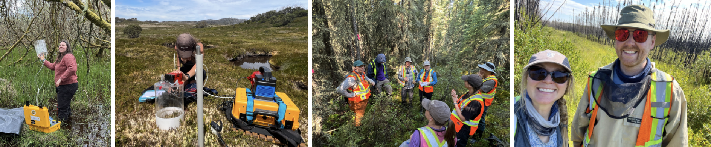

## **New opportunities for prospective students and post-docs**

  

If you are interested in joining my research group, I recommend starting by reading some of the group's recent publications in the areas that interest you (see Research and Publications). You may also want to explore the summaries of our current projects (see People) to get a sense of ongoing work in the lab. After considering how your interests align with mine, feel free to email Scott so we can discuss potential opportunities. Please include a CV and a transcript (an unofficial copy is fine at this stage).

Prospective graduate students and postdoctoral researchers are strongly encouraged to apply for relevant scholarships and fellowships.

## PhD Opportunities
*English follows*:

**‼️ Opportunités de doctorat – Dynamique du carbone dans les milieux humides au Québec! ‼️**

Je recrute deux doctorant·e·s motivé·e·s pour rejoindre la Chaire de recherche CARCLIQUE et travailler sur des projets de pointe portant sur le cycle du carbone et l’hydrologie des milieux humides au Québec – des tourbières boisées du sud jusqu’aux paysages arctiques du Nunavik. 

Si vous êtes passionné·e par les écosystèmes, le changement climatique, le travail de terrain et le cycle du carbone, c’est une occasion unique de contribuer à une recherche ayant un impact concret. 

Le Québec détient une diversité de milieux humides naturels absolument fantastiques

✅ Terrain + laboratoire

✅ Millieux humides, flux de carbone, hydrologie, microbiologie

✅ Travail dans des paysages exceptionnels (incluant le Nunavik!)

– Les détails complets des projets et des modalités de candidature se trouvent dans le document ci-joint.

– Les candidatures seront évaluées au fur et à mesure.

– N’hésitez pas à partager ou à transmettre à des personnes intéressées!

Veuillez contacter : davidson.scott_j@uqam.ca pour toute question ou pour soumettre votre candidature

—-

**‼️ PhD Opportunities – carbon dynamics in wetlands in Québec! ‼**

I am recruiting two motivated PhD students to join the CARCLIQUE Research Chair and work on cutting-edge projects focused on the carbon cycle and hydrology of Québec’s wetlands — from forested peatlands in the south to the Arctic landscapes of Nunavik.

If you are passionate about ecosystems, climate change, fieldwork, and the carbon cycle, this is a unique opportunity to contribute to research with real-world impact.

Québec has an incredible diversity of natural wetlands!

✅ Fieldwork + laboratory work

✅ Wetlands, carbon fluxes, hydrology, microbiology

✅ Work in exceptional landscapes (including Nunavik!)

– Full project descriptions and application details are available in the PDF below.

– Applications will be reviewed on a rolling basis.

– Don’t hesitate to share or forward to anyone who might be interested!

Please contact: davidson.scott_j@uqam.ca with any questions or an application

{width=100% height=800px}

