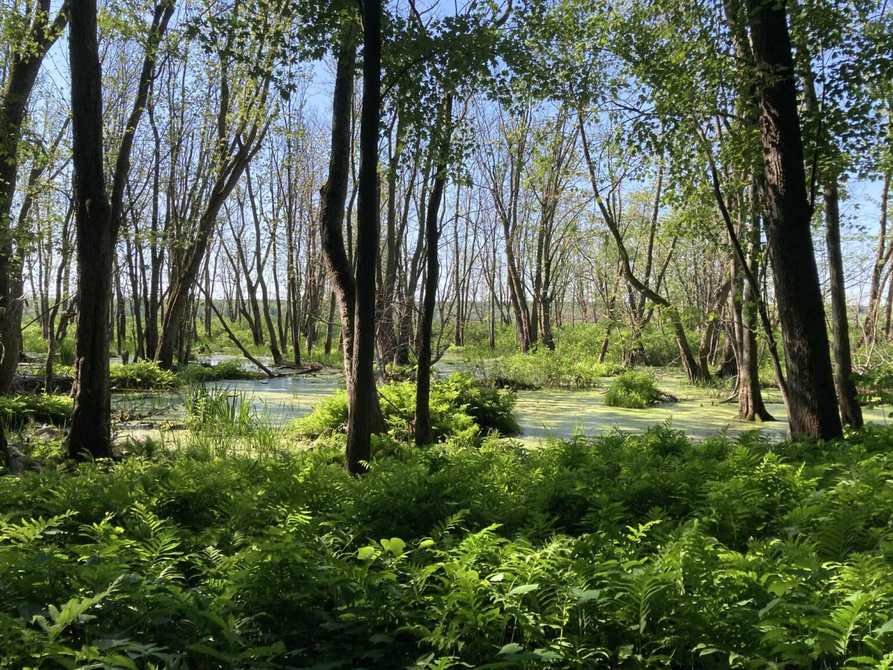
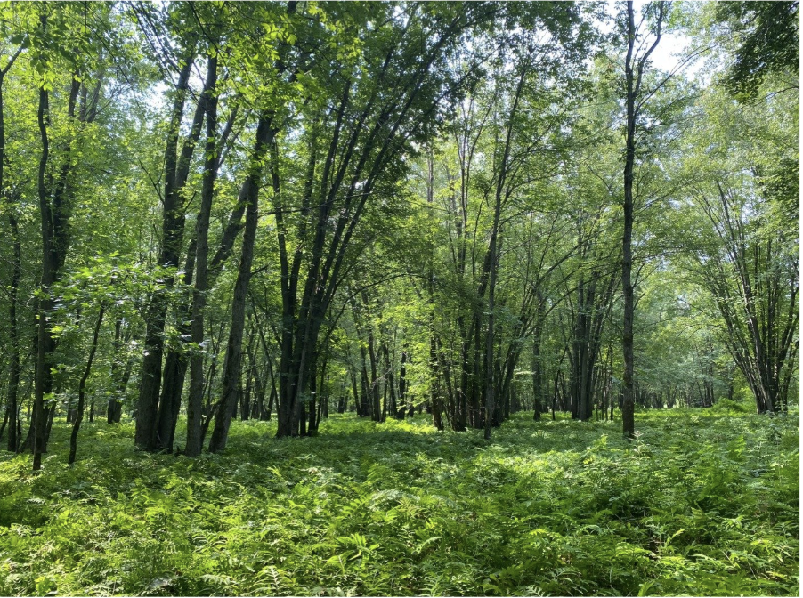

## **New opportunities for prospective students and post-docs**

  

If you are interested in joining my research group, I recommend starting by reading some of the group's recent publications in the areas that interest you (see Research and Publications). You may also want to explore the summaries of our current projects (see People) to get a sense of ongoing work in the lab. After considering how your interests align with mine, feel free to email Scott so we can discuss potential opportunities. Please include a CV and a transcript (an unofficial copy is fine at this stage).

Prospective graduate students and postdoctoral researchers are strongly encouraged to apply for relevant scholarships and fellowships.

## PhD Opportunities

**Disturbance Impacts on swamp and forested peatlands (southern Québec)**

  
  

 
**Project overview**: This project aims to quantify how anthropogenic disturbances such as agriculture, forestry, and road construction affect carbon cycling and hydrology in swamp and forested peatlands of southern Québec. 

**Research objectives**: 
1. Quantify carbon flux responses to disturbance: measure CO₂ and CH₄ fluxes from vegetation, soils and trees across forested wetlands with contrasting land-use histories. 

2. Evaluate peat and microbial responses: collect peat/soil cores, roots, and analyze microbial communities to assess how disturbance alters belowground carbon storage and processes. 

3. Assess hydrological alterations: install hydrology loggers to monitor water table variability and link changes to carbon fluxes and dissolved organic carbon export

---

**Impacts des perturbations sur les marécages et les tourbières boisées (sud du Québec)**

  
  

**Aperçu du projet** : Ce projet vise à quantifier l’impact des perturbations humaines telles que l’agriculture, la foresterie et la construction de routes sur le cycle du carbone et l’hydrologie dans les marécages et les tourbières boisées du sud du Québec. 

**Objectifs de la recherche** : 
1. Quantifier les réponses des flux de carbone aux perturbations : mesurer les flux de CO₂ et de CH₄ provenant de la végétation et des sols dans les milieux humides boisés 

2. Évaluer les réponses des sols tourbeux et des micro-organismes : prélever des carottes de tourbe/sol et des racines, et analyser les communautés microbiennes afin d’évaluer comment les perturbations modifient le stockage et les processus du carbone souterrain. 

3. Évaluer les modifications hydrologiques : installer des enregistreurs hydrologiques pour surveiller la variabilité du niveau phréatique et relier les changements aux flux de carbone et à l’exportation de carbone organique dissous.
