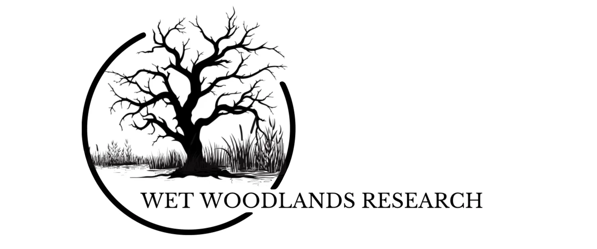
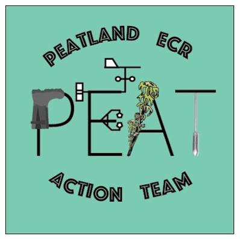

::: {.columns .person-row}
::: {.column width="22%"}
{.person-photo alt="Scott J. Davidson"}
:::

::: {.column width="78%"}
## SCOTT J. DAVIDSON, PhD

|  |  |
|---|---|
| **Pronouns** | He/Him |
| **Email** | <davidson.scott_j@uqam.ca> |
| **Position** | Assistant Professor in Wetland Carbon Dynamics  Co-holder of the Quebec Research Chair on the study of **CAR**bon in wetlands as a nature-based solution to combat **CLI**mate change in **QUE**bec (**CARCLIQUE**) |
| **Other positions** | Adjunct Professor at La Trobe University, Australia |
| **Education** | University of Sheffield / San Diego State University, PhD  University of Sheffield, MSc  University of Dundee, MA (Hons)  |
| **Links** | [{style="height:36px; width:auto; margin-right:18px; vertical-align:middle;"}](https://bsky.app/profile/wetlandresilienceresearchgroup.com) [{style="height:36px; width:auto; vertical-align:middle;"}](https://www.linkedin.com/in/scott-)

:::
:::

My research is focused on the resilience of peatland and wetland ecosystems to both climate change and disturbance regimes. I combine field research, laboratory analysis, remote sensing and modelling approaches to better constrain spatio-temporal dynamics of wetland ecosystems. 

I am a co-founder of both the Wet Woodland Research Network and PEAT: Peatland ECR Action Team. I am also currently the co-Chair of the British Ecological Society’s Peatlands and Wetlands Special Interest Group. You can click on the logos below to find more information.

  

  

  

## Lead supervision

::: {.student-grid}

::: {.student-card}
{.student-photo fig-alt="Emma Duley"}

Emma Duley

PhD Student

Understanding ecosystem dynamics in peat-forming temperate wet woodlands

ARIES DTP Studentship (2023–2027)

:::

::: {.student-card}
{.student-photo fig-alt="Frédérique Turmel"}

Frédérique Turmel 

MSc Student

Carbon stocks and fluxes of the Barachois de Malbaie salt marsh in Gaspésie, Eastern Canada

MITACS funded (2024-2026)

Co-supervisor: Dr Michelle Garneau (UQAM)

:::
:::

## Co-supervision
::: {.student-grid}

::: {.student-card}
{.student-photo fig-alt="Emily Simpson"}

Emily Simpson

PhD Student

Beavers and climate change mitigation in freshwater systems

IAPETUS DTP Studentship (2023–2027)

Lead supervisor: Dr Alan Law (University of Stirling)

:::

::: {.student-card}
{.student-photo fig-alt="Izadora Kervin"}

Izadora Kervin

PhD Student

Developing capacity in ex situ conservation for threatened bryophytes

2023-2029 (part-time)

Lead supervisor: Dr Jennifer Rowntree (University of Plymouth)

::: 

::: {.student-card}
{.student-photo fig-alt="Crystal Ahiable"}

Crystal Ahiable

PhD Student

The forgotten forests: understanding the future of wet woodlands as carbon-dense ecosystems

2023-2027

Lead supervisor: Dr Alice Milner (RHUL)

:::

::: {.student-card}
{.student-photo fig-alt="Dylan Oliver"}

Dylan Oliver

PhD Student

Maximising ecosystem service provision from wet woodlands for policy and practice

2025-2029

Lead supervisor: Dr Alice Milner (RHUL)

:::

::: {.student-card}
{.student-photo fig-alt="Justin Yu"}

Justin Yu

MSc Student

Building a baseline of carbon stocks in boreal swamps in Alberta, Canada

2024-2026

Lead supervisor: Dr Maria Strack (University of Waterloo)

:::

::: {.student-card}
{.student-photo fig-alt="Elly Longley"}

Elly Longley

MSc Student

Carbon fluxes from intact and disturbed alpine peatlands (wildfire) across the Bogong High Plains, Australia

2025-2027

Lead supervisor: Dr Aleicia Holland (La Trobe University)

::: 
:::

## Technical staff

::: {.student-grid}

::: {.student-card}
{.student-photo fig-alt="Léonie Perrier"}

Léonie Perrier

Coordinatrice de recherche de la Chaire du Québec sur l’étude du carbone dans les milieux humides comme solution naturelle aux changements climatiques (CARCLIQUE)

Research coordinator of the Quebec Research Chair on the study of carbon in wetlands as a natural solution to climate change (CARCLIQUE)

:::
:::

## Completed students

*PhD students*

**Natasha Underwood** PhD (2021-2024) (University of Plymouth) Ecological and biogeochemical benefits of environmental enhancements at Moorlinch on the Somerset Levels

*MSc students*

**Oscar Kemble** ResM (2024-2025) (University of Plymouth) – Evaluating progress towards blanket bog vegetation restoration

**Meg Schmidt** MSc (2019-2021) (University of Waterloo) – Impacts of seismic line restoration on CO2 and CH4 fluxes and vegetation biomass

**Rosie Oliver** MSc (2021-2022) (University of Plymouth) – Soil P indices in the Somerset Levels and Moors: a technical evaluation of their value in predicting environmental pollution risk

**Jamie Huntriss** MSc (2022-2023) (University of Plymouth) – An analysis of wet woodland carbon stocks based on peat core samples: a study of Slapton Ley wet woodland

**Caitlin Richards** MSc (2022-2023) (University of Plymouth) – Environmental controls on CO2 exchange in a wet woodland in South Devon and the implications of a changing climate

**Robert Jones** MSc (2022-2023) (University of Plymouth) – Understanding the susceptibility to and recovery from wildfire in peatlands using remote sensing

**Eleanor Wiltshire** MSc (2022-2023) (University of Plymouth) – Assessing the impacts of nitrate and ammonium on water quality in five Devon rivers between 2020 – 2022

**Archie Mortimer** MSc (2023-2024) (University of Plymouth) – Assessing the belowground carbon stocks of nationally scarce bog woodland in Scotland

**Jill Ashley** MSc (2023-2024) (University of Plymouth) – An investigation of the green leaf phenology of a canopy in Bobiri Forest, a semi-deciduous tropical forest in West Africa

*Undergraduate research assistants*

**Billy Fullwood** (June – August 2024) (University of Plymouth) – ARIES Research Experience Placement: Using dendrochronology to understand climate and land-use pressures on wet woodland ecosystem
