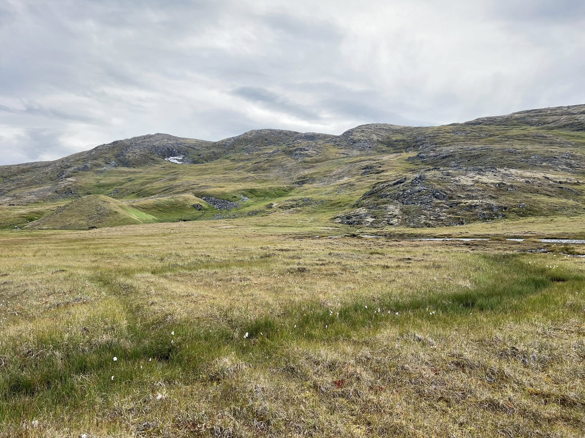
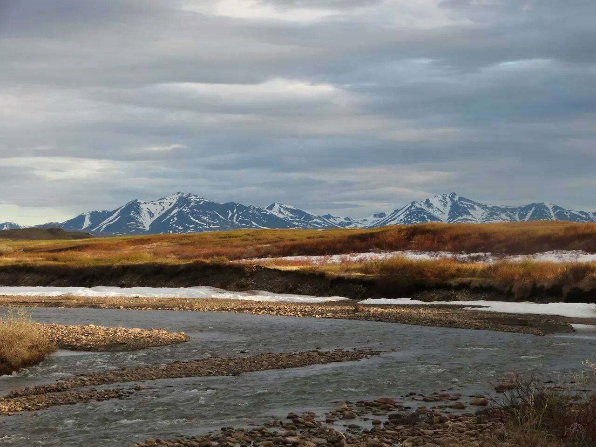
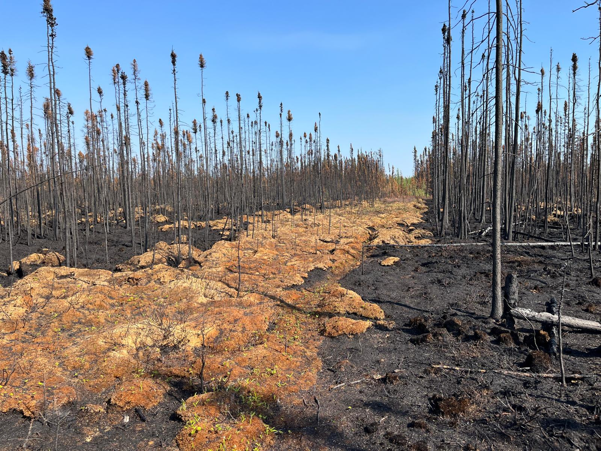
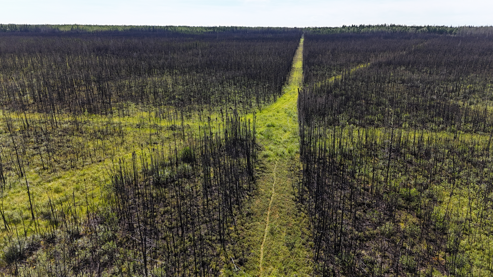
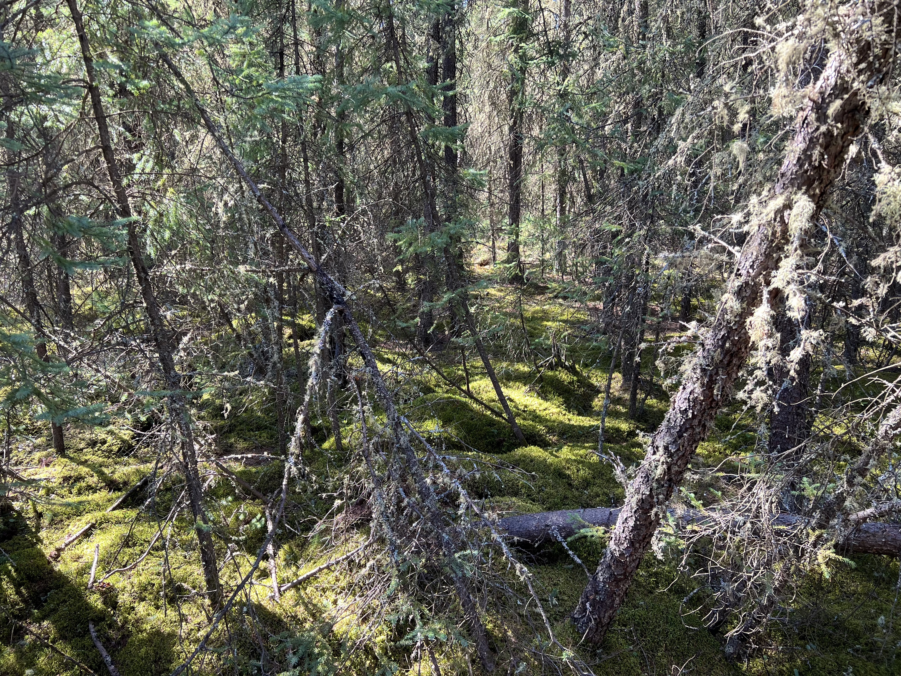
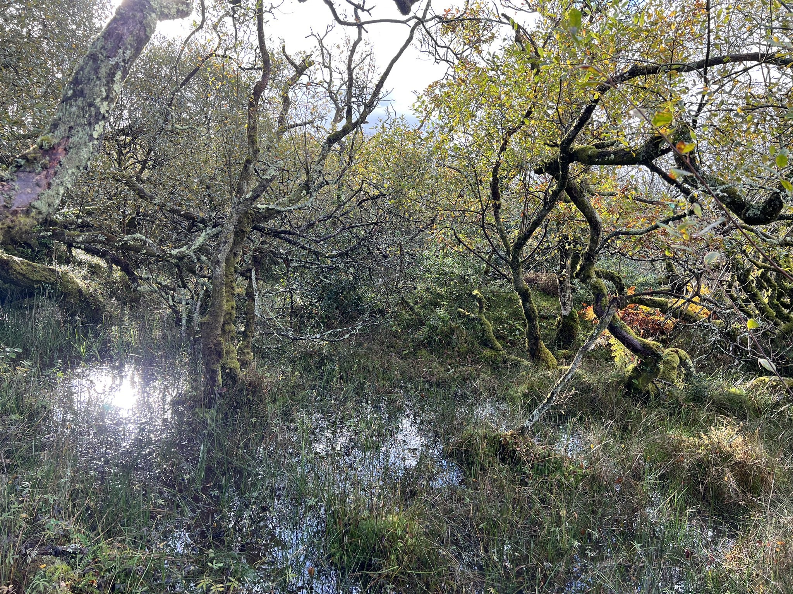
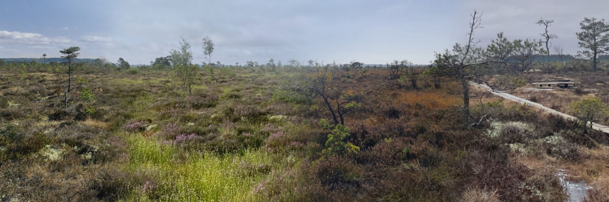
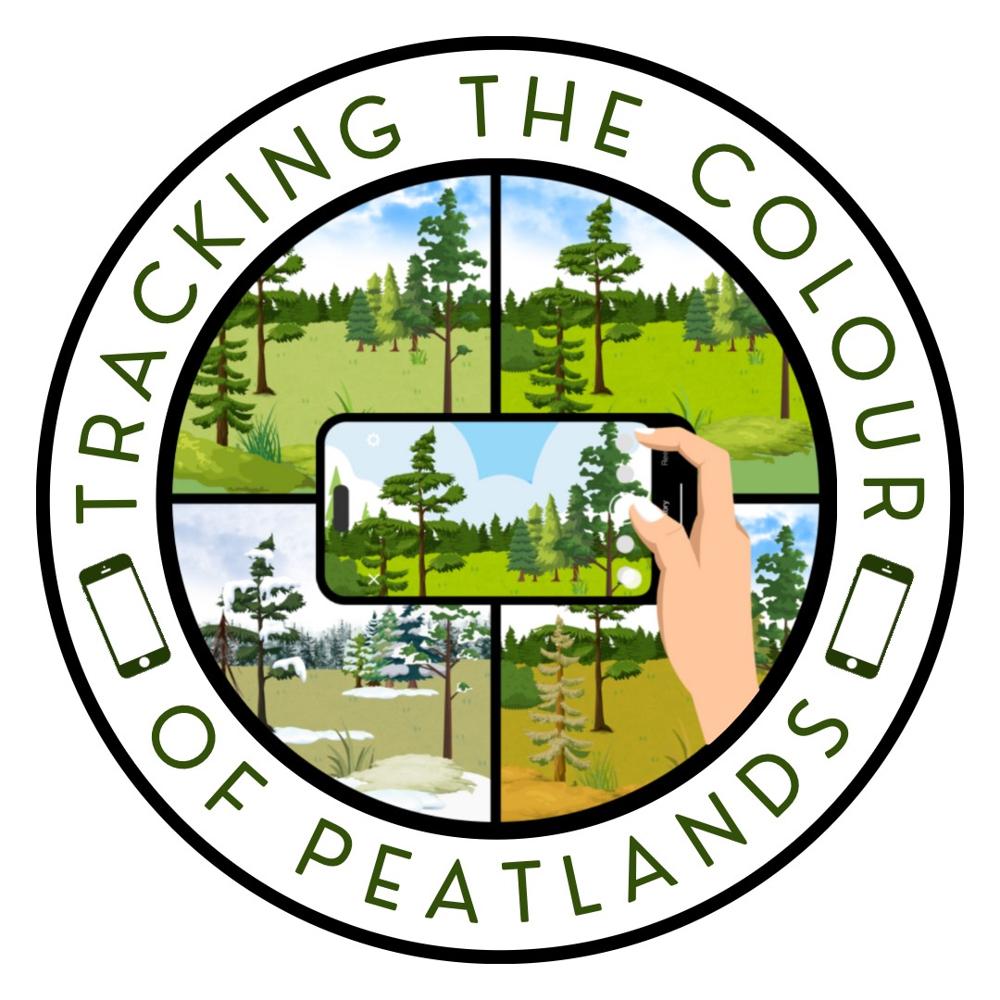
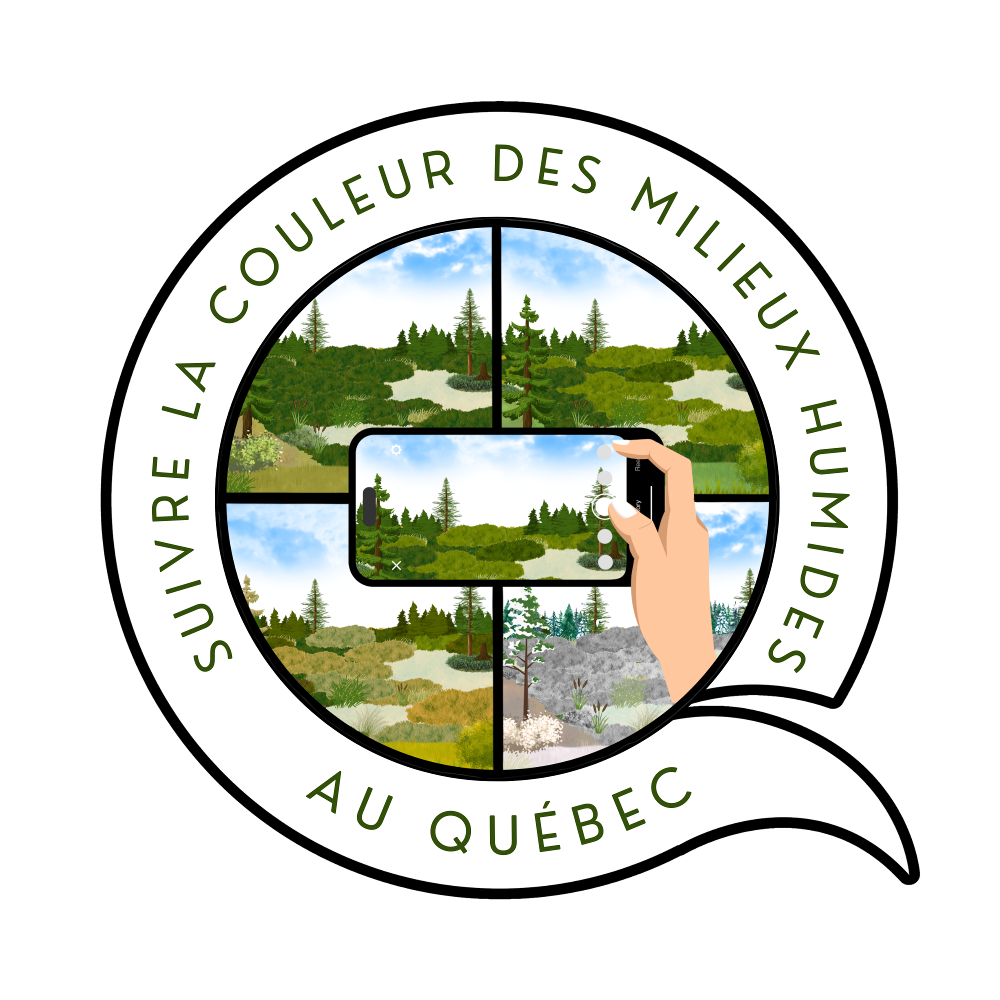

# Research

Our research investigates the resilience of wetland ecosystems to both climate change and disturbance regimes, as well as the roles these ecosystems can play as natural climate solutions.

We use a multi-scale approach, combining both field research and laboratory analysis with remote sensing and modelling approaches to better constrain spatio-temporal dynamics of wetland ecosystems.

With our work, we aim to contribute to a better understanding of the complex feedbacks between ecosystem resilience and disturbance regimes under a rapidly changing climate.

## **Carbon dynamics in northern wetlands and peatlands** 

  
  

Our research advances understanding of carbon storage and exchange across northern ecosystems, including permafrost peatlands and Arctic coastal wetlands. We investigate carbon stocks, greenhouse gas fluxes, and lateral transport pathways, and evaluate how permafrost thaw, hydrologic change, and vegetation dynamics influence carbon stability and climate feedbacks.

Scott is a co-investigator on [CARBONIQUE](https://carbonique.ca/en/), a five-year research programme investigating carbon cycling across Québec wetlands. The project quantifies carbon balances across natural and disturbed wetlands to better understand their role in climate-change mitigation and inform wetland conservation and management. CARBONIQUE is jointly funded by Québec’s MELCCFP through the 2030 Green Economy PLan, an NSERC Alliance – Advantage grant, and Ducks Unlimited Canada.

## **Response, recovery and resilience of wetlands and peatlands to change** 

  
  

We are interested in the vulnerability and resilience of peatland ecosystems to the impacts of wildfire. This includes vegetation dynamics following wildfire and post-fire biogeochemical cycling and carbon fluxes. This research is supported by an NSERC Discovery Grant awarded to Scott.

Similarly, we are interested in how peatland and wetland ecosystems function following disturbance from human activities, including drainage, resource extraction and forestry practices. This includes examining soil characteristics, vegetation community dynamics and carbon fluxes.

## **Forested wetland and marsh carbon dynamics** 

  
  

We are interested in improving our understanding of forested wetland (including swamps and wet woodland) and marsh ecosystem functioning globally. These are incredibly important yet under-appreciated wetland ecosystems. Scott is also a co-founder of the Wet Woodlands Research Network. You can explore the network by clicking the logo below;

  

## **Phenology of peatland and wetland ecosystems** 

{fig-align="center" width=1000}

We are focused on advancing understanding of peatland and wetland phenology (especially at the plot scale) and how these ecosystems change through time, particularly in response to climate variability and disturbance. By combining field observations, near-surface sensing, and satellite remote sensing, this work seeks to reveal when wetlands “green up,” reach peak productivity, and senesce, and how these dynamics regulate carbon exchange and ecosystem resilience. 

WWe also have two community science projects, **Tracking the Colour of Peatlands** and **Suivre la couleur des milieux humides au Québec**, which use photographs collected by members of the public to help us track greenness patterns in peatlands and wetlands. You can explore the projects by clicking the logos below.

  
  

  

