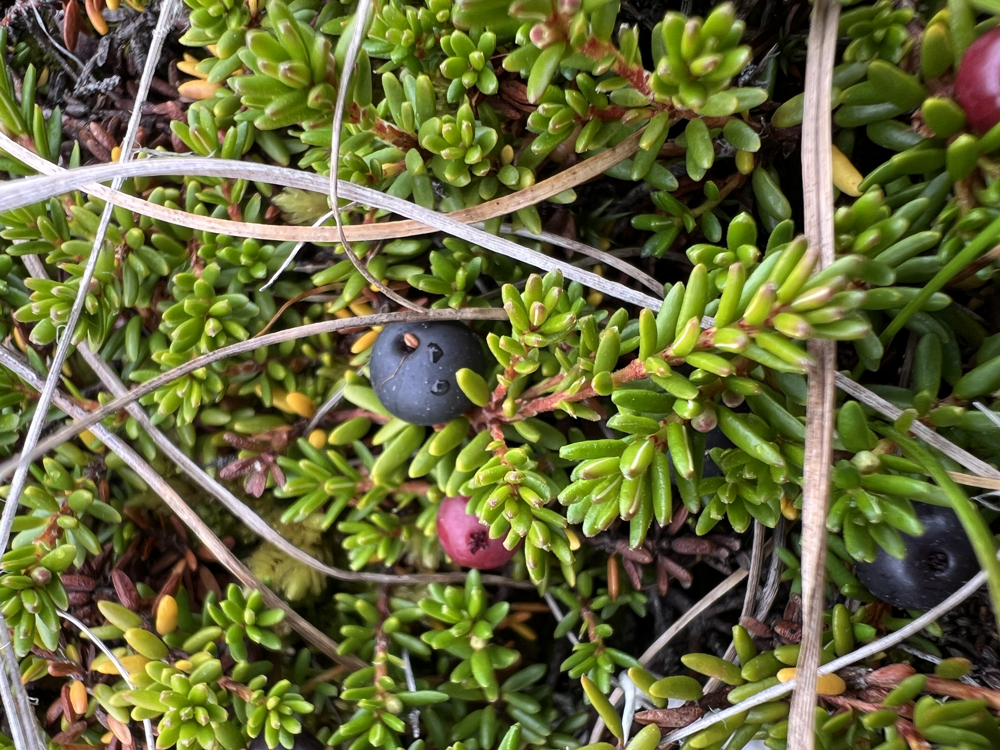
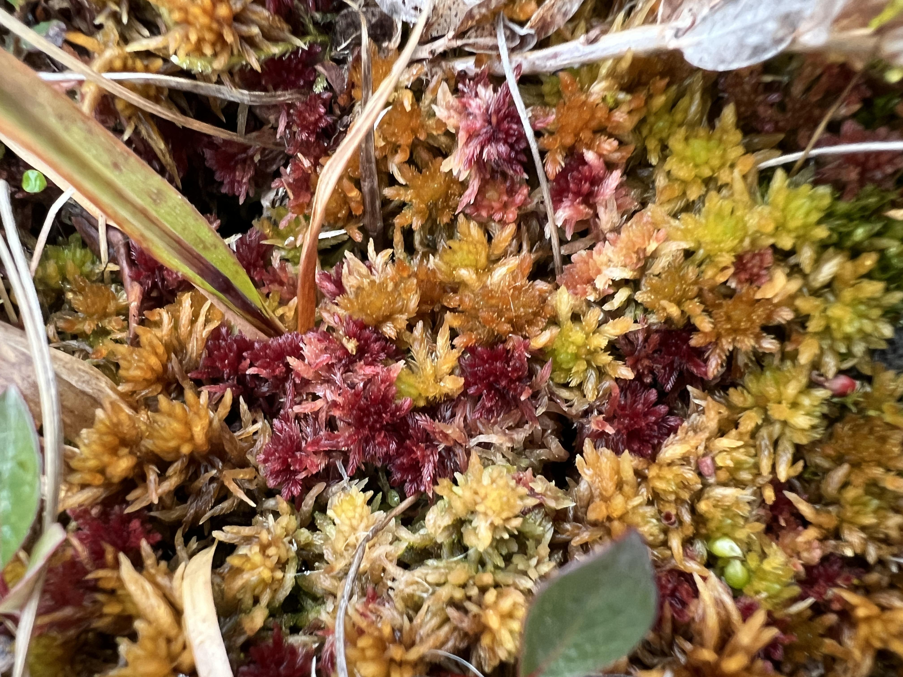
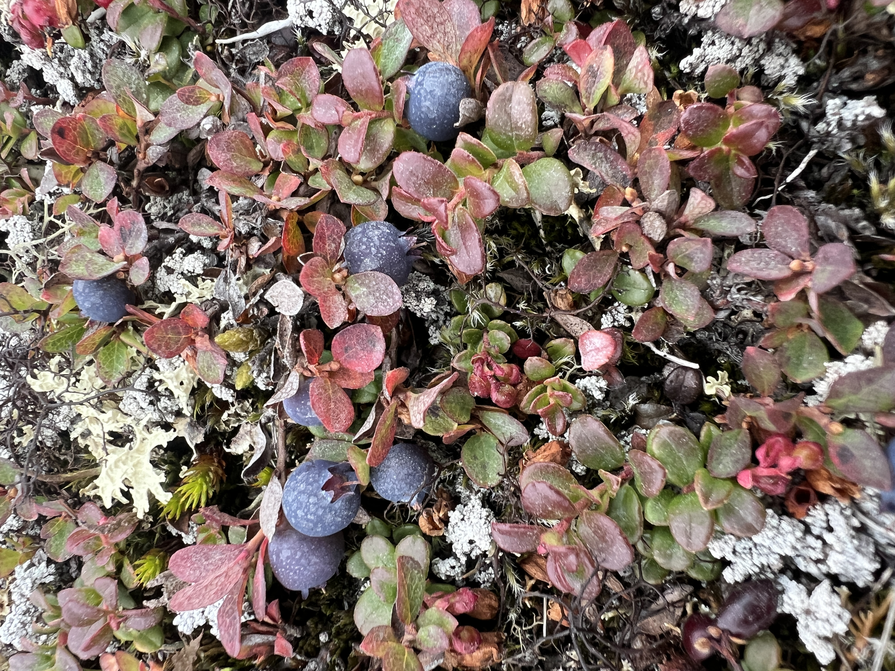

::: {.page-columns}
::: {.page-full}

::: {=html}

  
  
  

:::

:::
:::

# **Contact**

I’m always glad to connect with people who share an interest in wetlands, peatlands, carbon dynamics, and ecosystem functioning – whether you’re a researcher, practitioner, student, or part of an organisation exploring nature-based solutions.

If you’re curious about our work, would like to discuss a project, share data, explore a collaboration, or just start a conversation, please don’t hesitate to reach out. New ideas and perspectives are what keep research vibrant.

**Email:** davidson.scott_j@uqam.ca

