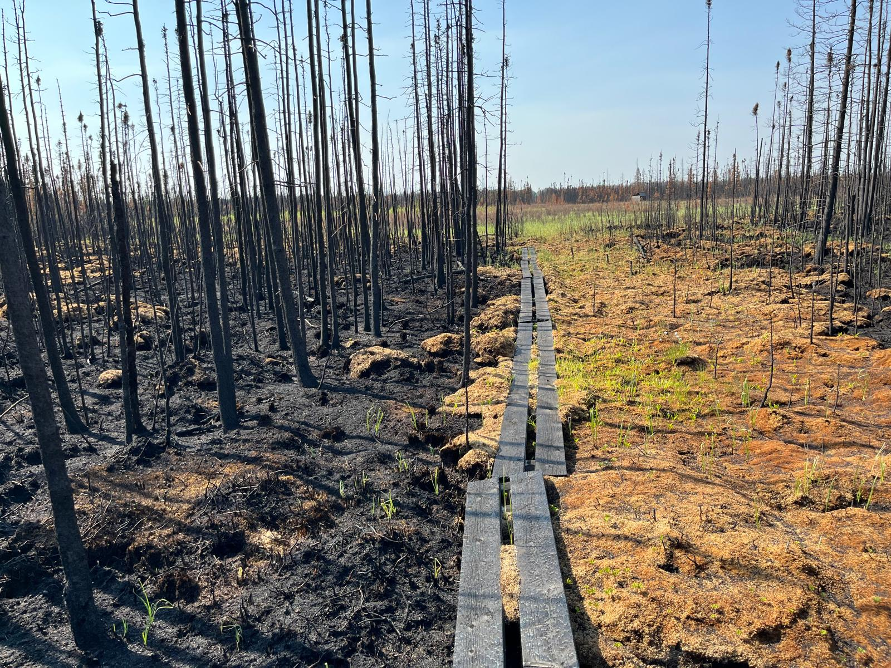

## Research in the Wetland Resilience Research Group
Our research sits at the intersection of ecology, environmental change, and ecosystem resilience, with a particular focus on peatlands and other wetland systems. We aim to understand how historical land use, climate change, and contemporary human pressures shape the structure, function, and recovery of these ecosystems. 

By integrating field observations, long-term monitoring, and experimental approaches, our work explores how wetlands and peatlands respond to disturbance, how key processes such as carbon storage, hydrology, and vegetation dynamics are altered, and which mechanisms underpin resilience or collapse. Ultimately, this research seeks to identify the pathways through which wetlands can be protected, restored, and managed to sustain carbon sequestration, biodiversity and ecosystem services in a rapidly changing world.

**Response, recovery and resilience of wetlands to climate and land-use change** 

  
  

XXX

**Wetlands and community science**
XXX

**Scott J. Davidson, PhD** 
**Assistant Professor in Wetland Carbon Dynamics** 
141 Avenue President Kennedy  
Département des sciences biologiques 
Université du Québec à Montréal 
Montréal QC 
Canada  
H2X 1Y4 
Email: davidson.scott_j(at)uqam.ca 